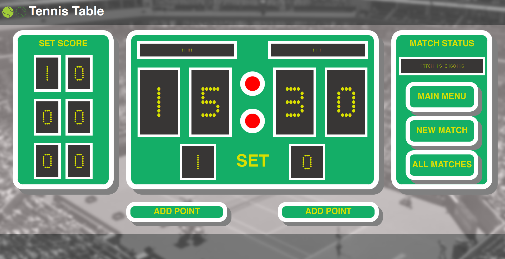
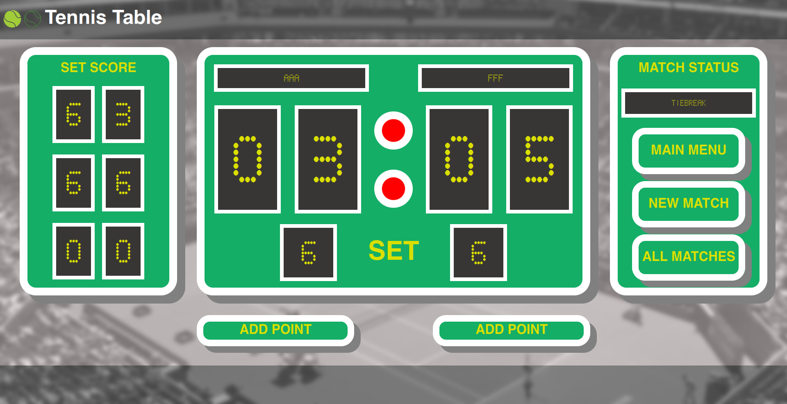

## Tennis Table

### Тайбрейк

### История матчей

## Стек
|||
|-|-|
|Backend|Waitress + Pure WSGI, SQLAlchemy + MySQL, Alembic, Jinja2, Poetry|
|Frontend|HTML, CSS, JS|

## Запуск
+ Переименовать `example.env` в `.env`
+ Запустить проект через `docker compose up`
